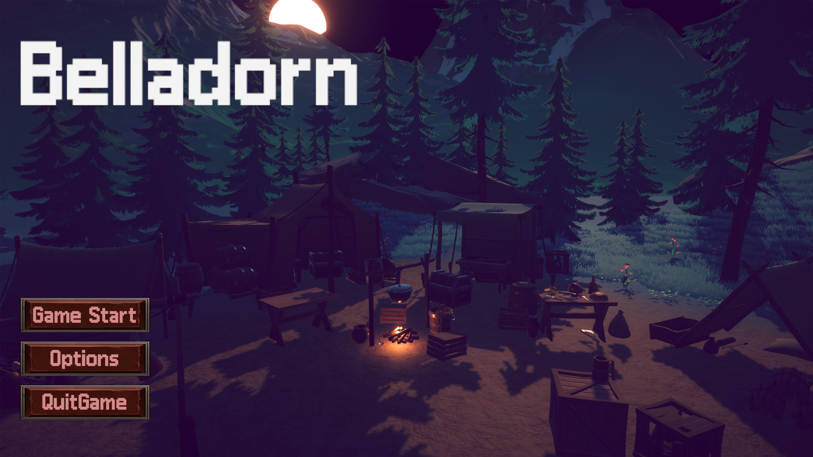

# 벨라도른 (Belladorn)

Unity 기반 3D 쿼터뷰 RPG 게임으로, 플레이어의 **자유로운 스킬 강화 시스템**을 통해 개개인의 **플레이 스타일에 맞는 전투 구성이 가능**하도록 설계했습니다.
**보스전**과 **시네마틱 전투 시스템**을 통해 몰입감 있는 전투 경험을 제공합니다.

> **개발 기간**: 2025.03.01 ~ 현재 (약 3개월 진행 중)  
> **플랫폼**: Windows PC (Unity 2022.3.44f1)  
> **팀 구성**: 3인 팀 프로젝트 (해당 README는 본인 구현 기능만 기술)

---

## 게임 스크린샷

## 게임 시작 화면

  

<i><Belladorn 메인 화면></i>

---

## 개발 환경 및 도구

- **Unity** 2022.3.44f1
- **C# / Visual Studio 2022**
- **Blender** (보스 위험 장판 기능 구현)
- Windows 10

---

## 사용 기술 (본인 구현 중심)

### 1. 플레이어 시스템
- FSM 기반 상태 전이 시스템 (Idle / Move / Attack / Skill / Dodge / Dead)
- 애니메이터 연동 및 상태 간 조작 제한 구현
- 공격 예약 입력을 통한 콤보 시스템
- NavMesh 기반 자동 거리 계산 및 도달 불가 시 이동 가능한 위치 보정
- 이동 마커 표시 기능 구현

### 2. 적 AI 시스템 (일반 몬스터 / 보스 몬스터 구분)

### 일반 몬스터

- **FSM 기반 상태 설계**: 대기 → 이동 → 탐지 → 공격 → 사망 → 경직 등 상태 전이 구현  
- **ScriptableObject 기반 Status 관리**: 체력, 공격력, 이동 속도 등 데이터 기반 구조  
- **확장성 중심 설계**: 새로운 일반 몬스터를 손쉽게 추가할 수 있도록 구조화  
- **카메라 연동 HP Bar UI**: 쿼터뷰 시점에서 항상 카메라 방향 기준으로 평행하게 체력바 표시  
- **몬스터 스포너**를 통한 위치 기반 몬스터 생성 시스템 구현

### 보스 몬스터

- **FSM 기반 상태 설계**: 대기 / 이동 / 공격 패턴 / 인트로 / 컷씬 / 사망 상태로 세분화  
- **ScriptableObject 기반 보스 Status 관리**: 체력 줄 수, 공격력, 사망 시 드랍 아이템 및 BGM 설정 포함  
- **패턴 중심 공격 시스템**: Close / Combo / Far / 강화 패턴 등 총 8종 공격 패턴 설계  
- **위험 장판, 이펙트, 히트박스 구현**: 타이밍 제어 및 애니메이션 이벤트 기반 연동  
- **애니메이션 별 속도 조절**: 각 패턴별 애니메이션 속도 커스터마이징  
- **체력 줄 수 기반 보스 체력 UI 구현**

### 3. 설계 및 구조
- 책임 분리, 유지보수 고려된 ScriptableObject 기반 데이터 구조
- 팀원들과의 협업 효율성을 위한 시스템화된 구조 설계

---

## 구현 기능 (본인 담당)

### 플레이어
- 쿼터뷰 이동 조작 (우클릭 이동 / 좌클릭 공격 / 스페이스 구르기)
- 기본 공격 콤보 시스템 (예약 입력 포함)

### 일반 몬스터
- 해골 / 해골 검사 / 해골 궁수 구현
- FSM 기반 탐지 → 이동 → 공격 / 복귀 루틴
- 복귀 시 무적 및 충돌 무시 처리
- ScriptableObject 기반 데이터화로 손쉬운 추가 가능

### 보스 몬스터 - **그람테르 (해골 장군)**
- 8개 공격 패턴: 근접 3 / 콤보 3 / 원거리 2
- 체력 50% 이하 시 강화 패턴 발동 (랜덤 번개 공격)
- Intro State 및 CutScene State를 통한 시네마틱 도입
- 위험 장판 시스템 및 공격별 회전/이동 제어
- 패턴 종료 후 대기 시간, 쿨타임, 중복 제한 등 커스터마이징

### UI
- 플레이어 체력 / 마나 / 경험치 / 레벨 UI
- 일반 몬스터 / 보스 체력 UI
- 데미지 텍스트 표시 기능

---

## 비고

- 본 README는 **본인이 직접 구현한 기능 중심**으로 기술되어 있습니다.
- 팀원 구현 기능은 포함하지 않았습니다.
- **유료 에셋 라이선스 문제를 피하기 위해, 해당 리포지토리에는 스크립트만 포함**하였으며 Unity 프로젝트 전체는 제공하지 않습니다.
---

## 향후 계획 / 개선점 (선택사항)

- 퀘스트 시스템 및 NPC 상호작용 확장
- 세이브/로드 시스템
- 직업 선택 및 캐릭터 성장 요소 강화

---

## 라이선스

본 프로젝트는 학습 및 포트폴리오 용도로만 사용되며, 상업적 사용은 금지되어 있습니다.

---

## 과거 프로젝트 경험 요약

### Unity 기반 - 물고기 키우기 (2021년 2학기 게임제작기초 수업 텀프로젝트)

- 물고기 조작 / 코인 수집 / 장애물 피하기 / 다양한 물고기 능력 구현
- FSM 기반 장애물 AI / UI 연동 / 모바일 대응 컨트롤러
- [2022 Unity 텀프로젝트 PDF](./Unity_Basic_3D_Game.pdf)

---

### Unreal Engine 기반 - 3인칭 RPG (2024년 2학기 게임프로그래밍 수업 기말 프로젝트)

- TPS 이동 / 공격 애니메이션 몽타주 / C++ Notify 기반 연속 공격
- HP, 스태미나, 무기 충돌 제어 / 다양한 상태 제한 구현
- [2024 Unreal RPG 프로젝트 PDF](./Unreal_3rdPerson_RPG.pdf)
